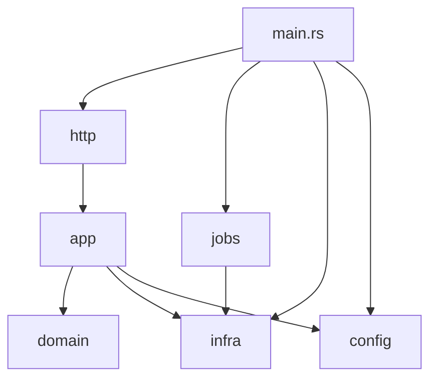
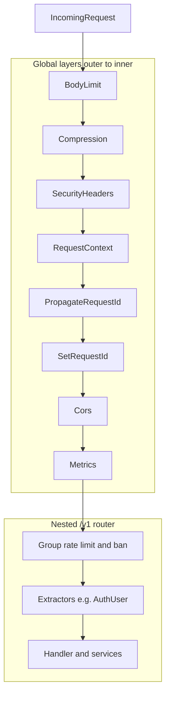
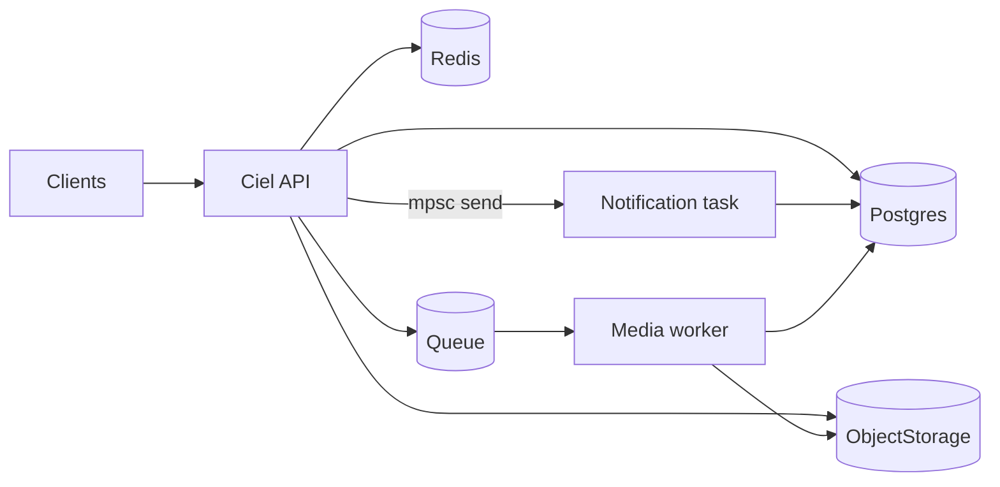

Ciel follows a **layered** layout: each layer depends only on the layer below it.

---

## Backend layers

```text
src/
├── domain/     # Structs (User, Post, Story, …) — no business logic
├── app/        # Services — DB, cache, domain rules
├── http/       # Axum routes, handlers, auth extractors, errors, middleware
├── infra/      # DB pool, Redis, S3, SQS clients
├── config/     # AppConfig from environment
├── jobs/       # Worker jobs (e.g. media_processor)
└── main.rs     # Entry: AppState, api vs worker mode
```

### Architectural decisions

- **Thin HTTP boundary**: handlers in `http/handlers.rs` parse/validate requests, call services, and map failures into `AppError`.
- **Service-centric business logic**: `app/` services own query composition, transaction boundaries, cache interaction, and domain rules.
- **Domain types as transport objects**: `domain/` structs are intentionally light and free of I/O concerns.
- **Infrastructure adapters isolated in `infra/`**: Postgres, Redis, queue, and object-storage clients are wrapped so service code depends on stable interfaces.

---

## Layer dependencies

Handlers depend on services; services depend on domain types and infrastructure. `main.rs` wires config, infra, and `AppState`, then starts either the HTTP stack (`http::router`) or job loops. `jobs/` uses the same infra types (pool, storage, queue) without going through HTTP.



---

## HTTP request lifecycle (global stack)

`http/mod.rs` builds the route tree first (`merge` / `nest("/v1", …)` / `with_state`), then applies **global** `Router::layer` calls. In Axum, each new layer wraps the previous stack: the **last** layer registered is the **first** to see an incoming request (see [Axum middleware ordering](https://docs.rs/axum/latest/axum/middleware/index.html#ordering)).

For this project, that means the outermost-to-innermost order on the request path is:

1. **Request body limit** (`RequestBodyLimitLayer`)
2. **Compression** (`CompressionLayer`)
3. **Security headers / HTTPS expectations** (`security_headers_middleware`)
4. **Request context** (trusted-proxy-aware client IP and scheme)
5. **Propagate request ID** (`PropagateRequestIdLayer`)
6. **Set request ID** (`SetRequestIdLayer` / `MakeRequestUuid`)
7. **CORS** (mobile API: limited methods and headers)
8. **Metrics** (`metrics_middleware`)

Only then does the router dispatch to `/health`, `/metrics`, or nested `/v1/...` routes. Route groups under `/v1` add their own middleware (IP rate limit, per-user rate limit, ban checks) **inside** the nested router, in the order declared in `http/mod.rs`.



---

## API mode: in-process background work

`APP_MODE=api` (and `combined`) is not only the HTTP server. `main.rs` also:

- Spawns **`jobs::notifications::run_notification_worker`**, reading from an `mpsc` channel whose sender lives on `AppState`, so handlers can enqueue notification work without blocking on full delivery.
- Spawns **`jobs::cleanup::run_cleanup_loop`** for periodic maintenance (for example story cleanup).

On shutdown, a **`CancellationToken`** is cancelled and the process waits (with a timeout) for those tasks to finish after the HTTP server stops. That keeps background work visible in the same binary as the API while still using async tasks instead of mixing everything into request handlers.

---

## Media and notifications (data flow)

**Media processing** decouples uploads from CPU-heavy work: the API persists intent in Postgres, enqueues a message, and returns; a **worker** process (or an extra task in `combined`) consumes the queue, reads/writes object storage, updates media rows, and acknowledges or retries based on transient vs permanent errors.

**Notifications** use in-memory **`mpsc`** from API handlers to a dedicated task, which writes notification rows (and related logic) in Postgres—no queue required for that path, at the cost of losing unsent jobs if the process crashes before the worker drains the channel.



**`combined` mode** runs the media **SQS consumer** in a `tokio::spawn` alongside the API, sharing `Db`, `ObjectStorage`, and `QueueClient` from the same `AppState`. **Split deployment** (`api` + separate `worker` processes) scales media throughput independently and is the usual production shape.

---

## Reading the Rust codebase

For a step-by-step reading order and how Rust features map to these files, see [Backend Rust guide](/docs/backend-rust-guide/).

---

## Runtime modes

`APP_MODE` controls process behavior from a single binary:

| Mode | What runs |
|------|-----------|
| `api` | HTTP API + in-process notification worker + cleanup loop |
| `worker` | SQS media processing loop only |
| `combined` | API and media worker in one process (useful in smaller environments) |
| `serverless-worker` | Minimal HTTP endpoint that executes one media job payload per request |

This split keeps the API path responsive while allowing background work to scale independently.

---

## Request path (API mode)

1. **Router assembly** (`http/mod.rs`) merges route groups from `routes.rs` and nests them under `/v1` (except `/health` and `/metrics`).
2. **Global middleware** is applied for request IDs, proxy-aware request context, security headers/HTTPS handling, compression, and body limits.
3. **Per-route-group middleware** adds auth-aware rate limiting and ban checks where required.
4. **Extractors** validate `AuthUser` (Bearer PASETO) or `AdminToken` for privileged routes.
5. **Handler/service flow** creates service instances from `AppState` clones and returns JSON or mapped HTTP errors.

---

## Middleware model

The middleware stack is intentionally layered to protect correctness at scale:

- **Request context first**: trusted proxy CIDRs determine whether `X-Forwarded-For` and `X-Forwarded-Proto` are honored.
- **Security middleware** relies on resolved scheme from request context, avoiding blind trust of forwarded headers from untrusted peers.
- **Rate limits** are split:
  - IP-based limits for unauthenticated/high-risk entry points (`/auth/login`, `/users`, `/health`).
  - User/trust-level limits for authenticated actions (`post`, `like`, `comment`, `feed`, `search`, `media_*`, moderation).
- **Metrics and request IDs** provide traceability and Prometheus-ready observability.

---

## Worker mode

The media worker is built for at-least-once delivery semantics:

- Polls SQS-compatible queues and processes one job at a time in a loop.
- Uses DB state transitions (`uploaded -> processing -> completed/failed`) to make retries idempotent.
- Classifies errors as transient vs permanent:
  - **Permanent** (e.g. unsupported image type/decode failure): mark failed and consume message.
  - **Transient** (network/storage/DB blips): keep message for retry.
- Produces derivatives (`thumb`, `medium`) and writes metadata back to Postgres.

In `api` mode, notification and cleanup background jobs are also managed with graceful shutdown.

---

## Monorepo context

Ciel Social splits **backend**, **iOS**, and **Android** into sibling projects. Clients talk to Ciel only over HTTPS; they do not share Rust code with the server.
