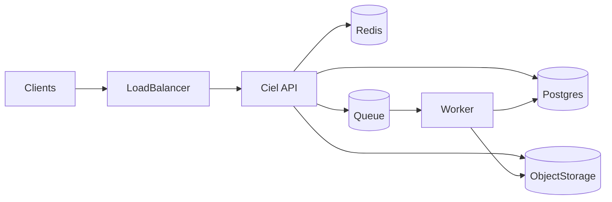

How major infrastructure pieces work together in a typical Ciel Social deployment.

---

## PostgreSQL

System of record for users, posts, comments, follows, stories, notifications, invites, moderation audit, etc. The API and worker connect via **SQLx** with a connection pool. Migrations version the schema.

Notable backend usage patterns:

- Cursor-based pagination (`timestamp/uuid`) for stable ordering under concurrent writes.
- Constraint-code aware error mapping (`23505`, `23503`) at the handler boundary.
- Status-transition guards for idempotent background jobs.

---

## Redis

Used for **caching** (e.g. home feed snippets) with TTLs. Keys follow `namespace:entity:id`. Cache misses fall through to Postgres and may repopulate Redis.

Operational guidance:

- Treat Redis as disposable acceleration.
- Keep TTL-driven caches short for personalized feeds.
- Alert on sustained cache errors, but expect graceful API fallback behavior.

---

## Object storage (S3-compatible)

**Uploads** — Clients receive presigned or policy-driven upload URLs from the API, then complete uploads through documented media endpoints.

**Processed media** — Workers write derivatives; the API and CDN expose public URLs for approved content.

In current media processing:

- Supported source types are image-oriented (`jpeg`, `png`, `webp`).
- Worker creates multiple derivatives (`thumb`, `medium`) per upload.
- Media metadata (dimensions, byte size, keys) is committed back to Postgres.

---

## Queue (SQS-compatible)

**Upload completion** and **media processing** are decoupled: the API enqueues work; the **worker** consumes messages idempotently and updates DB + storage.

Retry behavior:

- Permanent media errors are marked failed and consumed.
- Transient errors are retried by leaving the message visible per queue policy.
- DLQ configuration is recommended for poison-message containment.

---

## Load balancer (production)

Scaleway (or similar) terminates TLS and forwards to API instances. DNS for `api.<domain>` points at the load balancer. Health checks should target `/health`.

If you rely on forwarded client IP/scheme, configure trusted proxy CIDRs so the backend only trusts headers from known LB networks.

---

## Stories and cleanup

Stories are **time-bounded** (e.g. 24h visibility). The API process can run periodic tasks (e.g. hourly) to purge expired or stale story rows beyond a retention window.

This cleanup is intentionally background and best-effort; API reads should still enforce visibility windows.

---

## Flow (simplified)

