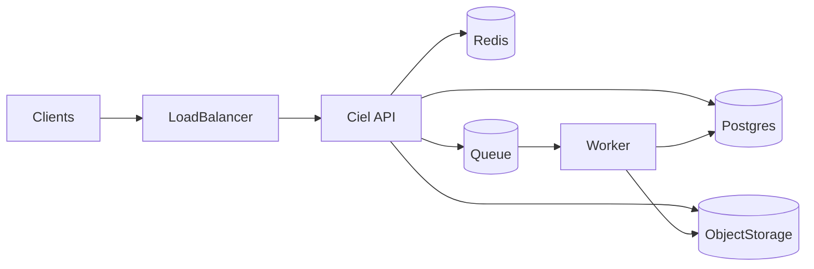

How major infrastructure pieces work together in a typical Ciel Social deployment.

---

## PostgreSQL

System of record for users, posts, comments, follows, stories, notifications, invites, moderation audit, etc. The API and worker connect via **SQLx** with a connection pool. Migrations version the schema.

---

## Redis

Used for **caching** (e.g. home feed snippets) with TTLs. Keys follow `namespace:entity:id`. Cache misses fall through to Postgres and may repopulate Redis.

---

## Object storage (S3-compatible)

**Uploads** — Clients receive presigned or policy-driven upload URLs from the API, then complete uploads through documented media endpoints.

**Processed media** — Workers write derivatives; the API and CDN expose public URLs for approved content.

---

## Queue (SQS-compatible)

**Upload completion** and **media processing** are decoupled: the API enqueues work; the **worker** consumes messages idempotently and updates DB + storage.

---

## Load balancer (production)

Scaleway (or similar) terminates TLS and forwards to API instances. DNS for `api.<domain>` points at the load balancer. Health checks should target `/health`.

---

## Stories and cleanup

Stories are **time-bounded** (e.g. 24h visibility). The API process can run periodic tasks (e.g. hourly) to purge expired or stale story rows beyond a retention window.

---

## Flow (simplified)

